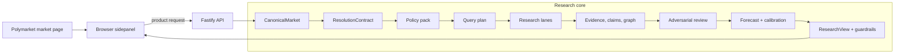
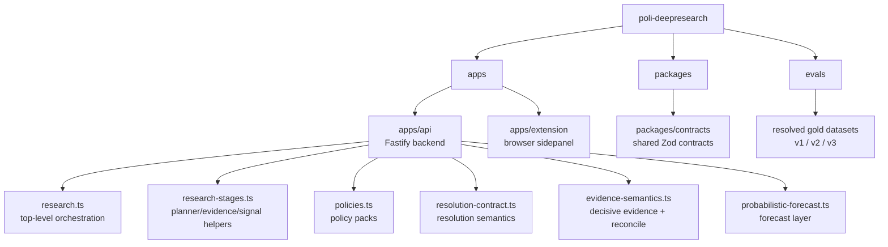

# Poli DeepResearch

Poli DeepResearch is a resolution-aware Polymarket research engine with a browser sidepanel.

It is built to answer a harder question than "what does the market say?":

`What would actually resolve this market, which sources matter, what does the evidence support, and how confident should the system be?`

The project is intentionally research-first. It does not anchor on market price during evidence gathering. Instead, it treats a market as a structured resolution problem, runs policy-driven research, pressure-tests the result, and only then compares the system view with market odds.

## What It Does

- Normalizes raw Polymarket markets into a canonical resolution-aware model
- Applies category and archetype specific policy packs
- Prioritizes official and decisive sources over generic web relevance
- Runs multiple research lanes:
  - direct official resolver
  - local-first Ollama reasoning
  - optional paid/search providers such as Parallel and xAI
- Extracts evidence documents and claims
- Builds an evidence graph and ranked source summary
- Runs an adversarial review pass
- Produces a probabilistic forecast and calibration summary
- Returns both:
  - a full run artifact for debugging and evaluation
  - a narrower product-facing response for the UI
- Renders the result in a browser sidepanel for live Polymarket market pages

## Core Design

The system is centered around a typed research pipeline:

1. Fetch and normalize the market
2. Build a `CanonicalMarket`
3. Derive a `ResolutionContract`
4. Select the applied policy pack
5. Generate a query plan
6. Run research lanes
7. Rank citations and extract evidence
8. Extract claims and graph artifacts
9. Run adversarial review
10. Build a probabilistic forecast
11. Calibrate the result against archived/resolved examples
12. Project the result into a product-facing `ResearchView`

This makes the repo more like a domain-specific inference engine than a generic agent wrapper.

## Visual Overview

### System map



### Runtime surfaces

```mermaid
flowchart LR
    RUN[Full research run artifact]
    PROJECT[Projection layer]
    PRODUCT[/product endpoints]
    LATEST[/latest endpoints]
    UI[Extension UI]
    DEBUG[Replay, debug, eval]

    RUN --> PROJECT
    PROJECT --> PRODUCT
    RUN --> LATEST
    PRODUCT --> UI
    LATEST --> DEBUG
```

## Repository Layout

```text
.
├─ apps/
│  ├─ api/         # Fastify backend and research pipeline
│  └─ extension/   # Browser sidepanel UI
├─ packages/
│  └─ contracts/   # Shared Zod schemas and public/internal contracts
├─ evals/          # Gold evaluation dataset(s)
├─ package.json
└─ README.md
```

### Repository map



## Architecture Highlights

### Resolution-aware market model

Markets are normalized into a canonical form with fields such as:

- category
- resolution archetype
- rules text
- official source requirements
- early-NO semantics

The engine also derives a `ResolutionContract` that captures:

- subject
- event label
- comparator
- threshold when applicable
- authority types
- decisive YES / NO rules

### Policy packs

The backend uses policy packs to encode market-specific research behavior.

Examples:

- politics / appointment or resignation
- macro / numeric threshold
- sports / winner of event
- entertainment / release or launch
- world / official announcement by deadline
- business / launch, negative occurrence, or official announcement

Each pack defines:

- source priority
- query focus terms
- decisive YES rules
- decisive NO rules
- contradiction rules
- escalation rules

### Local-first execution

The system is designed to stay useful even when paid providers are disabled.

Ollama is used for:

- local query refinement
- local opinion generation
- local claim extraction
- offline summary generation
- adversarial review steps

Optional providers can be layered on top for broader retrieval and comparison.

### Guardrails and product projection

The API distinguishes between:

- a full research run artifact
- a narrower product-facing response

The product view includes guardrails such as:

- `high_conviction`
- `monitor`
- `abstain`

and can apply confidence caps when the run is degraded, under-evidenced, local-only, or missing official sources.

## API Surface

Useful endpoints include:

- `GET /v1/health`
- `GET /v1/config/public`
- `GET /v1/markets/slug/:slug/context`
- `GET /v1/policies/slug/:slug`
- `GET /v1/signals/slug/:slug`
- `GET /v1/research/slug/:slug/latest`
- `GET /v1/research/slug/:slug/product`
- `GET /v1/research/market/:marketId/latest`
- `GET /v1/research/market/:marketId/product`
- `GET /v1/research/runs/recent`
- `GET /v1/research/run/:runId`
- `POST /v1/research/run/:runId/replay`

The `latest` endpoints return the full run artifact.

The `product` endpoints return the narrower UI-facing projection.

## Quick Start

### 1. Install dependencies

```bash
npm ci
```

### 2. Configure environment

```bash
cp .env.example .env
```

By default the stack is local-first. You can keep paid provider keys empty and run with Ollama only.

### 3. Start the API

```bash
npm run dev:api
```

The API listens on `http://127.0.0.1:4010` by default.

### 4. Build the project

```bash
npm run build
```

### 5. Run tests

```bash
npm run test:api
```

## Browser Extension

The extension lives in `apps/extension`.

It expects the backend to be reachable at:

`http://127.0.0.1:4010`

To build it:

```bash
npm run build:extension
```

Then load the generated extension from:

`apps/extension/dist`

The sidepanel displays:

- lean and confidence
- resolution status
- system odds vs market odds
- edge
- rationale and analyst take
- yes / no cases
- watch items
- ranked sources
- related markets
- probabilistic forecast
- adversarial review status
- calibration summary

## Scripts

Top-level scripts:

- `npm run build`
- `npm run dev:api`
- `npm run test:api`
- `npm run benchmark:providers`
- `npm run benchmark:business-tech`
- `npm run benchmark:live`
- `npm run benchmark:holdout`
- `npm run eval:gold`
- `npm run test:prompts`

These scripts are intended to keep the system measurable rather than purely prompt-driven.

## Current Status

The project already includes:

- policy-driven research orchestration
- official-source routing
- direct resolver paths
- local-first fallback lanes
- evidence extraction
- claim extraction
- evidence graph artifacts
- adversarial review
- probabilistic forecast
- calibration summaries
- cross-market context
- replay and recent-run endpoints
- benchmark and evaluation scripts

It is still an early product, but the architecture is already aimed at serious research workflows rather than chat-style output.

## Environment

The repo ships with `.env.example`.

Common variables:

- `API_HOST`
- `API_PORT`
- `DISABLE_PAID_RESEARCH`
- `OLLAMA_BASE_URL`
- `OLLAMA_MODEL_PRIMARY`
- `OLLAMA_MODEL_REASONER`
- `SERPER_API_KEY`
- `BRAVE_API_KEY`
- `EXA_API_KEY`
- `PARALLEL_API_KEY`
- `XAI_API_KEY`
- `TWITTERAPI_KEY`
- `FRED_API_KEY`

Leave optional provider keys empty if you want a local-only setup.

## Notes

- This repository is public-safe by design:
  - `.env` is ignored
  - local caches and run artifacts are ignored
  - generated build output is ignored
- The public repo is source-first. Benchmarks and private/local state are intentionally not tracked.

## License

No license file is included yet.
